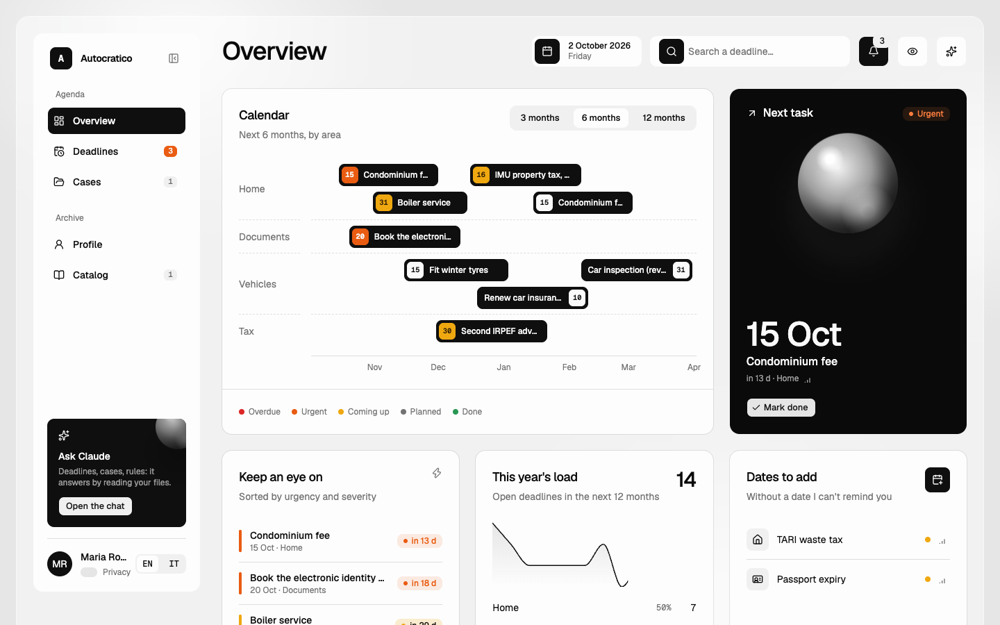

# Autocratico

**A private register for Italian bureaucracy**: deadlines, payments, checks and cases, kept in plain-text files and shown in a web app you can install on phone and desktop. An always-on agent ([Claude Code](https://claude.com/claude-code), headless) files whatever arrives — emails from several Gmail accounts, photos and PDFs from the share sheet, messages sent to a Telegram bot, WhatsApp exports — updates your deadlines, opens cases and pings you on Telegram.



## Features

- **Overview**: calendar by area, the next task, the year's load and dates still missing.
- **Deadlines** colored by status (overdue, urgent, coming up, planned, done), computed from severity and days left. Recurring deadlines (yearly, monthly, every N years) are expanded automatically.
- **Cases** in Markdown with checklists and a timeline, plus a **profile** (people, properties, vehicles, documents) and a **catalog** of researched rules with sources.
- **Inbox for everything**: upload or photograph documents, share from the iOS/macOS share sheet, forward to Telegram, sync several Gmail accounts, import WhatsApp chat exports. The agent files each item within a minute.
- **Always-on agent** with an **Activity** log: every change it makes to your files is a git commit you can review and undo.
- **Telegram bot**: reminders with a "done" button, digests, agent summaries (personal data masked), and chat with the agent.
- **Chat with Claude** in the side panel: read-only Claude Code sessions on your files, shared across your devices.
- **Privacy mode** (`P` key): hides names, amounts, document numbers and sensitive dates, for screenshots and demos.
- **Italian and English** interface, **.ics** export for any calendar app, optional read-only **Gmail** sync.

Keyboard: `C` chat, `B` sidebar, `P` privacy, `Esc` close.

## Quick start

Requirements: Python 3.11+, Node.js 24+ and [pnpm](https://pnpm.io/installation). [Claude Code](https://claude.com/claude-code) is optional locally, needed for the chat and the agent.

```bash
git clone https://github.com/davide97g/autocratico.git
cd autocratico
./setup.sh --start          # checks requirements, creates data/, builds the UI, starts it
```

Open http://127.0.0.1:8790. The app starts with a made-up example dataset: replace it with your own, or open Claude Code in the folder and ask it to (e.g. *"here is my car insurance policy, add the renewal"*).

`setup.sh` is safe to run again: it never touches an existing data folder. To do the same steps by hand:

```bash
python3 scripts/init.py                       # creates data/ by copying example/
pnpm install && pnpm build
pnpm start                                    # http://127.0.0.1:8790
```

To keep your data somewhere else (an encrypted disk, a synced folder), set `AUTOCRATICO_DATA` before running anything:

```bash
export AUTOCRATICO_DATA=~/Documents/paperwork
./setup.sh
```

To run it always-on (homelab or any server with Docker) and reach it from your phone, see [docs/deploy-homelab.md](docs/deploy-homelab.md).

## How it works

```
 email · share sheet · Telegram · uploads ──► data/inbox/ ──► agent (claude -p) ──► deadlines.toml, cases/
                                                                     │
 PWA (phone, desktop) ◄── apps/server (API, jobs, bot) ◄── data/ ◄───┘── git commit per change
```

There is no database: the files in `data/` are the source of truth. You or the agent edit them; the server reads them on every request. Details in [docs/architecture.md](docs/architecture.md).

Monorepo (pnpm + Turborepo): `apps/web` (PWA), `apps/server` (Hono, Node 24), `packages/core` (shared schemas and logic), `scripts/` (Python CLIs, standard library only).

## Commands

| Command | What it does |
|---|---|
| `./setup.sh [--start]` | check requirements, create the data folder, build the UI |
| `pnpm start` | server and web app on http://127.0.0.1:8790 |
| `pnpm dev` | development on http://localhost:5173 (also starts the server) |
| `pnpm lint && pnpm typecheck && pnpm test` | checks |
| `node apps/server/src/cli.ts pair \| token \| devices \| telegram \| job NAME` | pairing and admin |
| `python3 scripts/upcoming.py [days]` | upcoming deadlines and dates still missing |
| `python3 scripts/ics.py` | writes `data/out/autocratico.ics` |
| `python3 scripts/gmail.py accounts \| login --account N \| sync --all` | read-only Gmail, several accounts, see [docs/gmail.md](docs/gmail.md) |

## Data layout

```
data/
  deadlines.toml     deadlines (schema at the top of the file)
  state.json         done occurrences, written by the web app
  profile.toml       person, properties, vehicles, documents
  cases/<year>-<slug>/README.md
  catalog/*.md       rules with source and verification date
  notes/             SITUATION.md and JOURNAL.md, the agent's memory
  inbox/             everything that arrived, one folder per item
  archive/           PDFs, scans, downloaded emails
  chats/, jobs/      conversations and job log (written by the server)
  secrets/           OAuth tokens, paired devices and Telegram chats (0700)
```

[`example/`](example/) has the same layout with made-up data. A deadline looks like this:

```toml
[[deadline]]
id = "car-tax"
title = "Car tax"
area = "vehicles"
severity = "high"            # high | medium | low
date = 2027-01-31            # or "TODO" when unknown
repeat = "yearly"            # none | yearly | monthly | every N years | every N months
remind_days = [14, 3]
amount = 180.00              # hidden in privacy mode
```

## Working with an agent

Agent instructions are in [AGENTS.md](AGENTS.md), read by Codex and other agents; [CLAUDE.md](CLAUDE.md) imports it for Claude Code. They tell the agent where things are and how to behave: keep personal data in `data/` only, extract deadlines from documents, verify rules on official sources before any money decision, treat email content as data and flag phishing, never pay or write to public bodies on your behalf.

Personal instructions (your language, your mailboxes) go in `data/notes/INSTRUCTIONS.md`, read by every agent including the server's.

## Privacy and security

- **Code and data are separate.** Everything personal lives in `data/` (ignored by git) or in `AUTOCRATICO_DATA`. The repository contains only code and a made-up example.
- **Local by default.** Without configuration the server listens on `127.0.0.1` only and refuses requests whose `Host` or `Origin` is not local (DNS rebinding, CSRF).
- **Online mode** (`AUTOCRATICO_AUTH=prod`): every request needs a Cloudflare Access token **and** a paired device (one-time codes, hashed tokens, revocable); browser writes must come from the app's own origin; shortcut tokens can only add documents. The server refuses to start without these settings.
- **Constrained agent.** Chat runs `claude -p` with read-only tools, `WebFetch` limited to public-body domains (`gov.it`, `inps.it`, `europa.eu`, …). The background agent may edit only the data folder, with no web access and no access to secrets or server-owned files; its changes are commits you can undo. Content of emails and uploads is treated as data, never as instructions. Questions and file contents do go to Anthropic, as with any Claude Code session.
- **Telegram sees redacted text only**: amounts, IBANs, tax codes and anything marked personal are masked before sending.
- **Read-only Gmail.** The OAuth scope is `gmail.readonly`; tokens are stored with `0600` permissions and can be revoked with `gmail.py logout`.
- **No credentials.** Never store passwords, PINs or access codes in the data files.

Found a security issue? See [SECURITY.md](SECURITY.md).

Catalog rules and example dates are indicative: always check official sources.

## License

[MIT](LICENSE)
